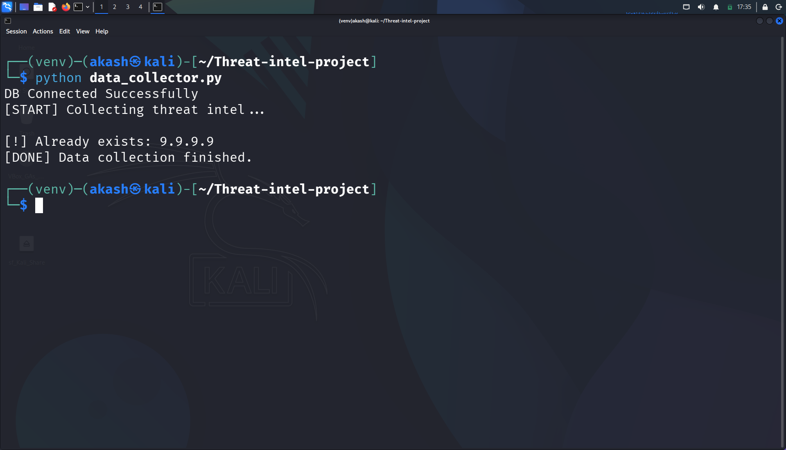
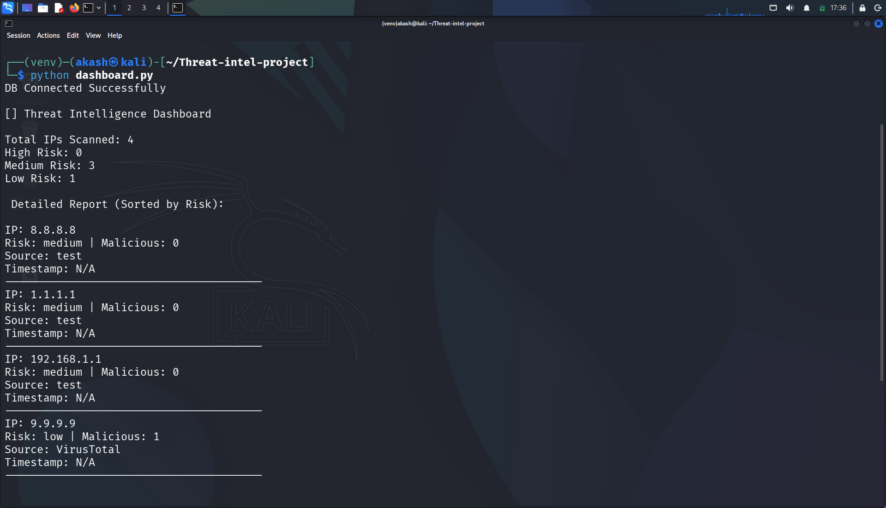

# Threat Intelligence Project
## Overview

This project collects and analyzes IP address data using the VirusTotal API. 
It checks whether an IP is malicious or safe and stores the results in MongoDB. 
A simple dashboard is used to display and sort the data based on risk leve

## Features
- Collects IP threat data from VirusTotal API
- Stores data in MongoDB
- Displays risk level (high, medium, low)
- Dashboard with sorted output

## Technologies Used
- Python
- MongoDB
- VirusTotal API

## How to Run
1. Add API key in data_collector.py
2. Run:
   python data_collector.py
3. Run dashboard:
   python dashboard.py

## Output
- Shows IP risk levels
- Sorted report based on risk

## Threat Intelligence Dashboard Output

  

## Threat Intelligence Collection Output

  

